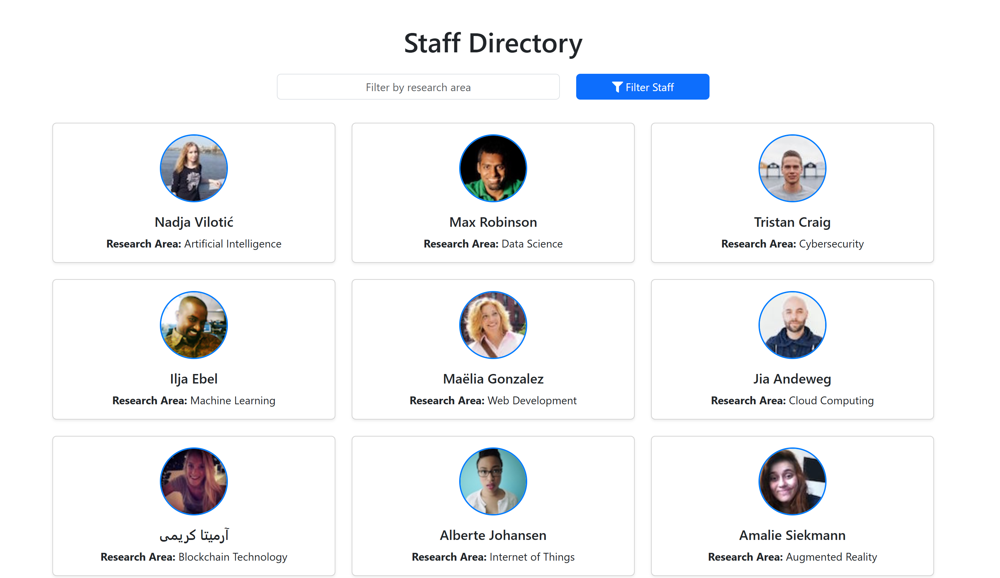

# Staff Directory Web App

## 📝 Overview

A Staff Directory web app that fetches staff research areas from a custom Flask API and combines them with random profile details from the [Random User API](https://randomuser.me/).  




## 🖼️ Technologies Used

- HTML, CSS, JavaScript  
- Bootstrap 5  
- FontAwesome  
- Flask (Python)  
- RandomUser.me API  
- GitHub Pages (for deployment)

---

## 🧠 How to Run in Codespaces

> This app uses a Flask backend and GitHub Pages for the frontend. The frontend is already hosted, but to run the backend locally in Codespaces:

In Github Codespaces, 

1. Install dependencies:
pip install -r backend/requirements.txt 

2. Switch to Backend folder which contains the Flask API
cd backend

3. Run Flask server:
flask run --host=0.0.0.0 --port=8000

IMPORTANT: Make sure port 8000 is public

When the Flask server starts, set the 8000 port to Public in the Codespaces Port Tab. 
If the port is Private, the frontend will not be able to fetch data from the Backend API

---

## 🚀 Live Demo

- 🌐 Frontend (GitHub Pages): [View App](https://pedromarkfernandes.github.io/staff-directory/)
- 🔧 Backend API (Codespaces): Run in Codespaces and set **Port 8000** to **Public**

---

## 🚀 Features

- 🔍 Filter staff by research area (case-insensitive)
- 🧑 View detailed staff info in a Bootstrap modal
- 🎨 Random user images + real API integration
- 📱 Fully responsive and clean UI

---

## 🌐 Flask API Documentation

My backend API is written in Flask and serves staff data. Here are the endpoints:

### `GET /` or `GET /staff`
Returns all staff members
Example: GET http://localhost:5000/

### `GET /?area=`
Returns staff filtered by research area using a query parameter. (case-insensitive match)
Example: GET /?area=Cybersecurity

### `GET /staff/<id>`
Returns details for a single staff member.

Example: GET http://localhost:5000/staff/3

---

## 🗂 Project Structure
```
staff-directory/
├── index.html  # Frontend UI
├── script.js   # Frontend JavaScript
├── style.css   # Custom styling
├── screenshot.png  # Screenshot for README
├── README.md   # This file
├── backend/
│   ├── app.py  # Flask backend API
│   └── requirements.txt   # Backend dependencies
```
---